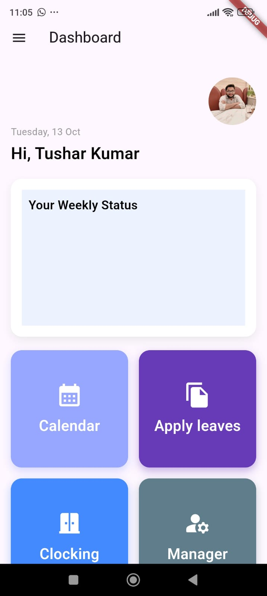
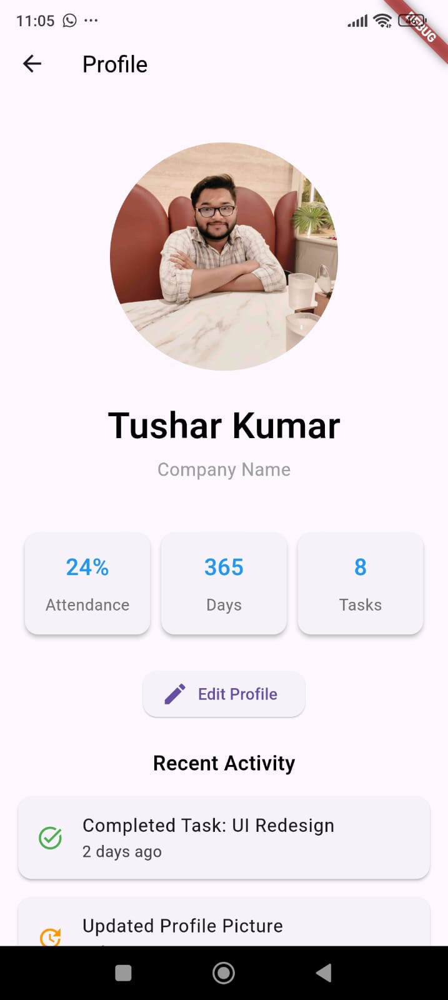

# ESS App - Flutter Project

## Overview
The ESS (Employee Self-Service) App is a Flutter-based mobile application designed to help employees manage various tasks related to their leave management, attendance, face verification, and profile management.

## Features
- **Face Verification**: Uses Google ML Kit for face detection and verification. Face data is stored in shared preferences for accurate and secure verification.
- **Leave Management**: Allows employees to apply for leave and check the status of their leave requests. Managers can review and approve leave requests.
- **Profile Management**: Provides employees with a customizable profile screen where they can view and edit their personal information.
- **Dashboard**: A centralized hub that displays employee-related information such as attendance, leave status, and more.
- **Responsive UI**: The app UI is designed to be responsive and adjusts to different screen sizes, ensuring a smooth experience across devices like phones and tablets.
- **Dark/Light Theme Support**: The app supports both dark and light themes, providing a personalized experience for users.

## Screenshots
Here are some screenshots of the app in action:

| Dashboard | Profile Screen | Face Verification |
|-----------|----------------|-------------------|
|  |  |  |

*Note: You should add the screenshots to the `assets/screenshots/` directory in your project and update the image file paths accordingly.*

## Technologies Used
- **Flutter**: Framework for building the app UI and logic.
- **Google ML Kit**: For face detection and verification.
- **Shared Preferences**: For local data storage.
- **Firebase (Optional)**: For backend integration, authentication, and real-time database.
- **Animated Theme Switcher**: For theme switching between light and dark modes.
- **Camera Plugin**: For capturing and verifying face images.

## Setup and Installation

### Prerequisites
- Flutter SDK installed (version 3.x or later)
- Android Studio or Visual Studio Code for development
- Xcode for iOS development (optional)

### Clone the repository
```bash
git clone https://github.com/yourusername/ess_app.git
cd ess_app
